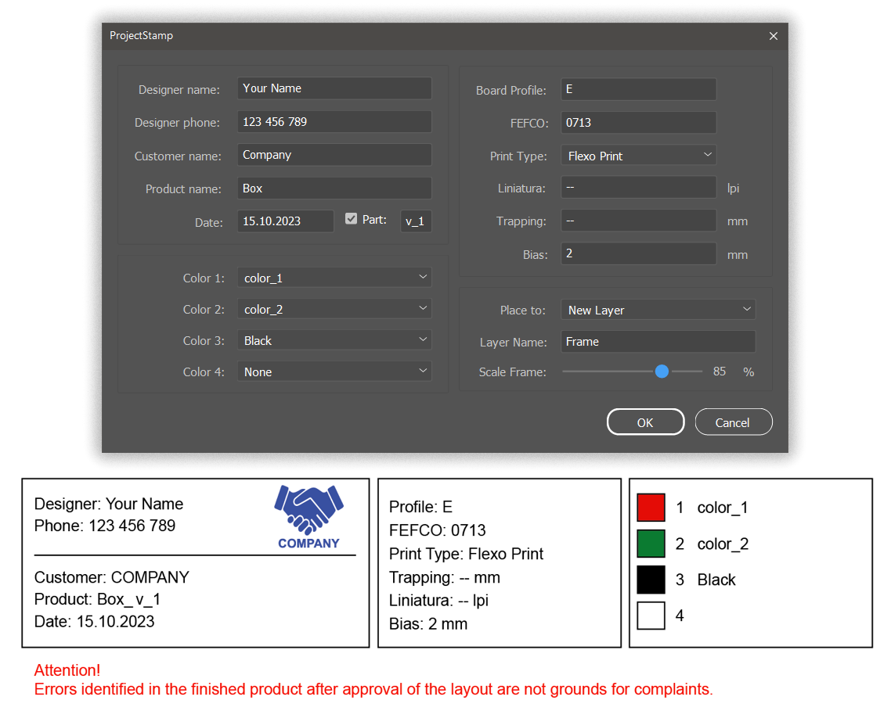

# ProjectStamp
Script for Adobe Illustrator.  
Adds a frame of project metadata entered into the form.

 
The script uses the file "Assets/Template.svg" as a template.  
The placement of elements inside the frame can be changed (do not change the text of the text elements).

  
Permanent information can be specified in "Assets/DesignerProfile.txt".   
It will be automatically added to the form field.

  

# Installation
You can run the script without installation right away by selecting the menu File → Scripts → Other Script, then Illustrator will ask you to specify the location of the file or drag the script file onto the Illustrator window with the mouse.

# Download
[Last releases](https://github.com/VGmove/ProjectStamp/archive/refs/heads/main.zip).
